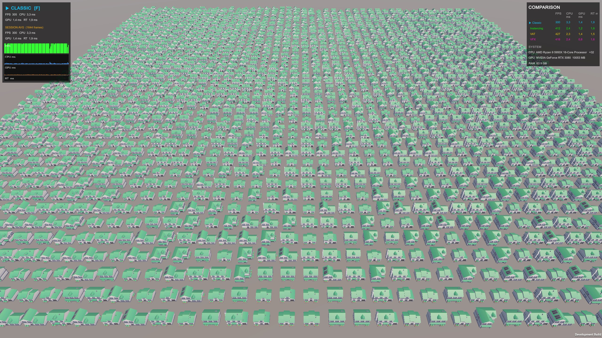
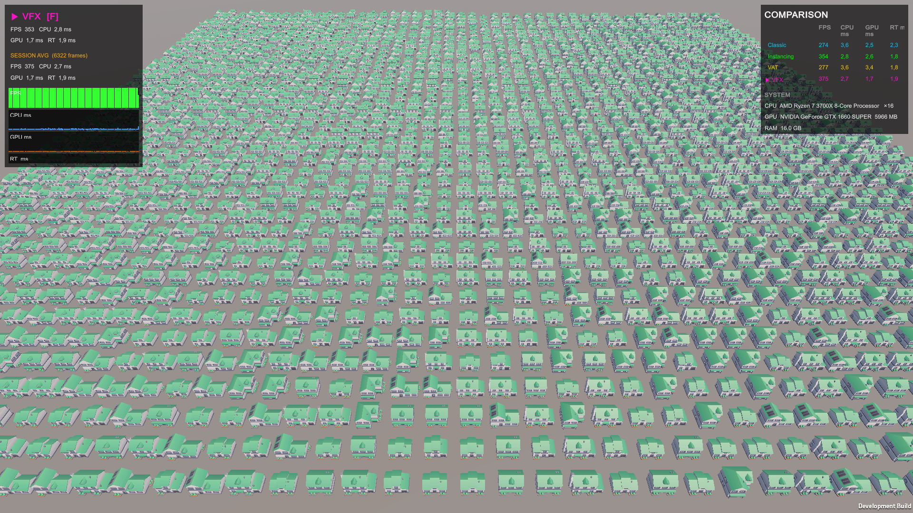

# VertexOpti — Rendering Benchmark

A Unity project comparing four GPU instancing strategies on the same scene.  
Press **F** at runtime to cycle through modes. A HUD displays FPS, CPU, GPU and render-thread times side by side.

---

## Rendering Modes

| # | Mode | Key class | Draw calls |
|---|------|-----------|------------|
| 0 | **Classic** | `MeshRenderer` per instance | 1 per instance |
| 1 | **GPU Instancing** | `InstancingInstanceRenderer` | 1 per unique mesh |
| 2 | **VAT** | `VATInstanceRenderer` | 1 total |
| 3 | **VFX Graph** | `VFXGraphRenderer` | handled by VFX |

### Classic
Standard Unity MeshRenderers on a dedicated **"Classic"** layer. No special setup.  
The camera culling mask hides this layer in all other modes.

### GPU Instancing
`Graphics.RenderMeshInstanced` — one call per unique mesh type using the real source meshes.  
Requires **Enable GPU Instancing** on the material. No baker needed.  
Limited to 1023 instances per call; `InstancingInstanceRenderer` chunks automatically.

### VAT (Vertex Animation Texture)
All instances share a **single flat base mesh**. The vertex shader looks up real positions and normals from a texture atlas, one row per mesh type.  
This eliminates all per-instance draw calls at the cost of a baking step and some texture bandwidth.

> **When to use:** large counts of static or pre-animated objects; similar wins to GPU Instancing but with a single draw call.

### VFX Graph
A single `VisualEffect` component receives all instance data through a typed `GraphicsBuffer`.  
`VFXGraphRenderer` builds the buffer every time the instance list changes and calls `Reinit()` on the VFX so it spawns exactly N particles, each reading its transform and mesh index from the buffer.

> **What makes VFX Graph different here:** the rendering pipeline (mesh selection, material, lighting) is entirely defined inside the VFX asset. The C# side is purely a data pump.

---

## Scene Setup

### Layers
Create two layers in **Edit → Project Settings → Tags and Layers**:

| Layer | Purpose |
|-------|---------|
| `Classic` | MeshRenderer GameObjects — toggled by camera culling mask |
| `VAT` | VAT child GameObjects — used by `VATInstanceRenderer` for its `RenderParams.layer` |

### Spawner — `VATBenchmarkSpawner`
Attach this to an empty GameObject. Right-click it in the Inspector and choose **Spawn Benchmark Grid**.  
It generates a square grid of `instanceCount` parent objects, each with four children (Classic / VAT / Instancing / MDI).

Key fields:
- **Source Meshes** — the mesh variants (one index per type, shared across all modes)
- **Instance Count** — total objects; grid side = `ceil(sqrt(count))`
- **Spacing** — world-unit gap between cells

### Manager GameObjects
Each rendering mode needs exactly one manager in the scene:

| Component | Requires |
|-----------|---------|
| `VATInstanceRenderer` | `vatBaseMesh`, `vatMaterial` |
| `InstancingInstanceRenderer` | `instancingMaterial` |
| `VFXGraphRenderer` | `vfxAsset`, `sourceMeshes[]`, `mainTexture` |

Wire them to **BenchmarkHUD** so the F key can toggle modes.

---

## Baker Tools

### VAT Baker — `Tools → VAT Baker`
Produces three texture atlases and a shared base mesh from your source meshes.

**How it works:**  
Each source mesh is *expanded* — shared vertices are duplicated so every triangle corner becomes a unique vertex. This gives every mesh a predictable, flat vertex layout `[v0, v1, v2, v3, v4, v5, ...]`.  
The atlases are then written pixel-by-pixel:
- **PositionAtlas** — world-space vertex positions (one row per mesh, one column per vertex)
- **NormalAtlas** — vertex normals in the same layout
- **UVAtlas** — original UV coordinates

The base mesh is a dummy with all vertices at the origin; `UV0.x` encodes the raw vertex index as a float so the shader can do a direct texel fetch (`Load`) with no filtering.

Meshes shorter than the widest one are padded with degenerate triangles (all three corners collapse to the same point → zero area → GPU discards them automatically).

Output assets land in `Assets/VATBaker/Generated/` by default.

> **Important settings:**  
> - *Flatten Submeshes* — merge all submeshes into one before expanding (recommended)  
> - *Full Float Precision* — use `RGBAFloat` instead of `RGBAHalf` if you see precision artifacts on large meshes

---

## VFX Graph Setup

The VFX asset (`Assets/MultiMeshesGraph/MultiMeshesGraph.vfx`) needs to be wired to read from the C#-side buffer.

### Blackboard properties to expose
| Name | Type |
|------|------|
| `InstanceBuffer` | `StructuredBuffer<VFXInstanceData>` |
| `InstanceCount` | `int` |
| `MeshA` … `MeshF` | `Mesh` |

`VFXInstanceData` is defined in `VFXGraphRenderer.cs` with `[VFXType(VFXTypeAttribute.Usage.GraphicsBuffer)]`, which makes it appear as a selectable type inside the VFX Graph editor.


---

## File Reference

```
Assets/
├── Scripts/
│   ├── VATBenchmarkSpawner.cs       — editor-time grid spawner
│   ├── BenchmarkHUD.cs              — runtime overlay + mode toggle (F key)
│   ├── VATRenderer.cs               — per-instance component (VAT)
│   ├── VATInstanceRenderer.cs       — central manager (VAT)
│   ├── InstancingRenderer.cs        — per-instance component (GPU Instancing)
│   ├── InstancingInstanceRenderer.cs— central manager (GPU Instancing)
├── VATBaker/
│   └── Editor/                      — VAT baker pipeline                    — MDI baker pipeline
└── MultiMeshesGraph/
    ├── MDIGraph.vfx                 — VFX Graph asset
    ├── VFXInstance.cs               — per-instance component (VFX Graph)
    └── VFXGraphRenderer.cs          — central manager + buffer builder (VFX Graph)
```

---

## Credits

Assets use for benchmark are the wonderful Kenney's Assets [Kenney's Website](https://kenney.nl/assets/city-kit-suburban).

---

## Performance Benchmarks

The following benchmarks provide a comparative analysis of different configurations across various scenarios.

### Key Observations
* **Hardware Sensitivity:** Vertex Animation Textures (VAT) provide a performance uplift **exclusively on modern hardware**. On older architectures, GPU Instancing remains more efficient or equivalent.
* **Mesh Variety & Scaling:** VAT is the optimal choice for scenarios requiring **high mesh diversity** or high instance counts with **low to medium polygon density**. It scales significantly better than standard instancing when handling many distinct animated models.
* **VFX Graph:** This serves as a high-performance, "low-code" alternative to Indirect/GPU Instancing, offering native support for instance variation and efficient **GPU Culling**.

### Contributions
Community data is welcome. To contribute your own benchmark results, please submit a **Pull Request**.

---

### Hardware Comparison Results

#### NVIDIA GeForce RTX 3080


#### NVIDIA GeForce GTX 1660 Super


#### NVIDIA GeForce GTX 1060 6GB
